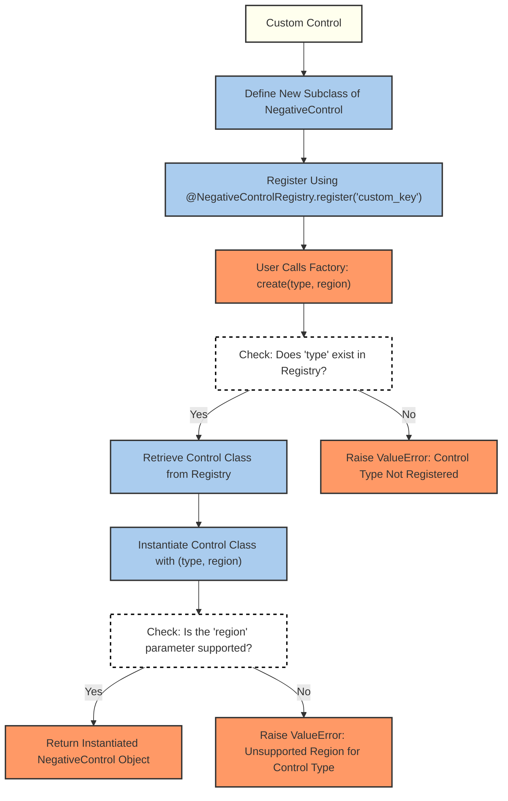

# Negative Controls for Radiomics Analysis

## Main Idea

Users should be able to apply a variety of transformations to their radiomics images

- 3 defined types of negative controls (e.g., shuffled, randomized, randomized_sampled)
- or their own custom negative controls

This module aims to provide a standardized way to apply transformations to radiomics images, allowing users to easily compare the effects of various transformations on their data.

## Overview

The `negative_controls` module provides a standardized way to apply transformations (negative controls) to radiomics images. Negative controls can help assess and compare the effects of various transformations on imaging data. This module is designed to be extensible, allowing users to easily define and register new types of controls.

## Core Components

1. **Negative Control Types (`NegativeControlType`)**: Enumerates the types of controls (e.g., `SHUFFLED`, `RANDOMIZED`, `RANDOMIZED_SAMPLED`).
2. **Negative Control Regions (`NegativeControlRegion`)**: Specifies where the control should be applied (e.g., `FULL`, `ROI`, `NON_ROI`).
3. **Abstract Base Class (`NegativeControl`)**: Defines a consistent interface for all controls.
4. **Registry (`NegativeControlRegistry`)**: Manages available controls, enabling easy extension and integration.
5. **Factory (`NegativeControlFactory`)**: Creates instances of controls based on type and region.


## Flow Diagram

The following diagram illustrates the process of how, given a list of negative controls, the NegativeControlFactory creates instances of the appropriate control classes.

The NegativeControlFactory uses the NegativeControlRegistry to dynamically instantiate NegativeControl objects based on the provided type and region.


The returned NegativeControl instances can then be iterated over and applied to the image as needed.

## How to Define New Negative Controls

Adding new types of negative controls involves three simple steps:

1. **Create a New Class**:  
   Define a new subclass of `NegativeControl` and implement the `apply` method. This method should describe how the transformation is applied to the image.

   ```python
   from readii.negative_controls.base import NegativeControl
   from readii.negative_controls.enums import NegativeControlType

   # This is how it would be defined in the library, using the enums
   @NegativeControlRegistry.register(NegativeControlType.SHUFFLED)
   class ShuffledControl(NegativeControl):
       def apply(self, baseImage, roiMask=None, randomSeed=None):
           # Define how the image will be shuffled
           pass

   # Custom Noise Negative Control
   @NegativeControlRegistry.register(
      "custom_noise",
   )
   class CustomNoiseControl(NegativeControl):
       def apply(self, baseImage, roiMask=None, randomSeed=None):
           # Define how the image will be modified
           # can literally be any function that takes in the baseImage (and roiMask if applicable)
           # and returns the modified image
           pass
   ```

2. **Register the New Control**:  
   Use the `@NegativeControlRegistry.register` decorator to add your new control type to the system.

   Note: The decorator takes a single argument, which is the unique identifier for your control type. This allows you to define the main library NC types but also custom ones (e.g., NegativeControlType.SHUFFLED or "custom_noise").

3. Implementing the `apply` method:

   The `apply` method is the core of the transformation.
   It is abstract and is assumed to be implemented by subclasses.

   There is an additional feature of `region` that is used to specify where the transformation should be applied.
   Your subclass MUST implement this feature and return the appropriate transformation
   OR raise a `ValueError` if the region is not supported and is passed to the factory.

4. **Instantiate Using the Factory**:  
   Create an instance of your control using the `NegativeControlFactory`:

   ```python
   from readii.negative_controls.factory import NegativeControlFactory
   from readii.negative_controls.enums import NegativeControlType, NegativeControlRegion
   from readii.negative_controls.registry import NegativeControlRegistry

   control_instances = NegativeControlFactory.create(
       control_type=NegativeControlType.SHUFFLED,
       control_region=NegativeControlRegion.ROI
   )
   ```

### What does this do?

1. It will check if there is a class registered with the given type.
2. It will instantiate the class with the given type and region.
3. It will return the instantiated class.

